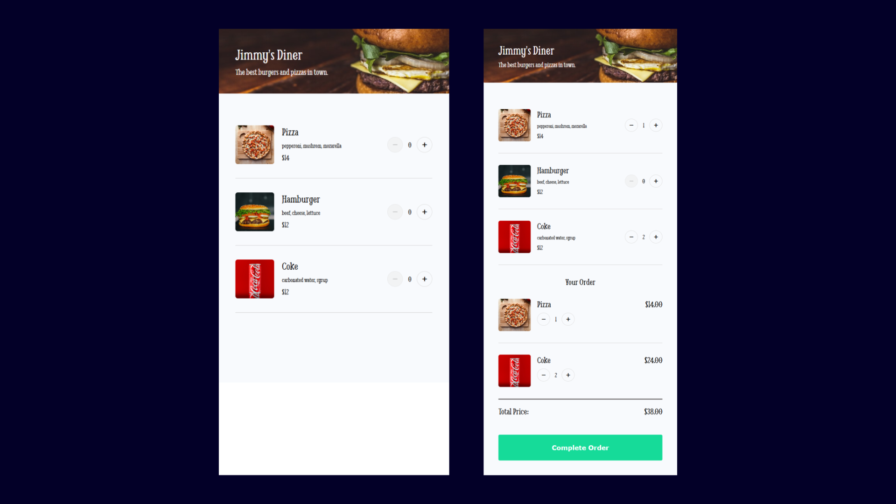
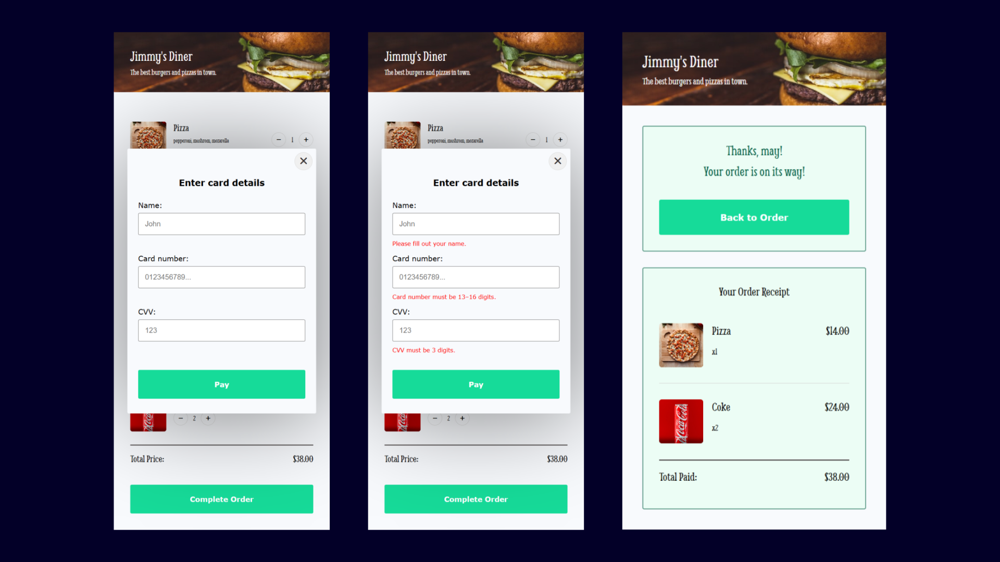

# 🍔 Food Ordering App

A solo project from the [Scrimba Frontend Developer Career Path](https://scrimba.com/frontend-path-c0j).  
A restaurant ordering app where users can add menu items, adjust quantities, and complete payment via a simple modal form. Orders and total prices update dynamically in real-time.

## 🛠️ Tech Stack
- HTML5
- CSS3
- JavaScript (ES6+)

## 🚀 Features
- Render menu dynamically from JS data array.
- Add/remove items and adjust quantities.
- Real-time total price updates.
- Payment modal form with validation and receipt.

## 🧠 What I Learned 
- DOM manipulation & template rendering.
- Event delegation for dynamic elements.
- State management with arrays/objects.
- Form validation & error handling.
- Writing reusable JS functions.

## 💡 Future Improvements
- Meal deal discounts.
- User ratings and feedback.
  
## 🖼️ Preview

## 🙌 Credits
- **Scrimba course:** [Scrimba Frontend Developer Career Path](https://scrimba.com/frontend-path-c0j)
- Additional code improvements by me.
- **Design reference:** [Figma by Scrimba](https://www.figma.com/design/Hdgwo69Dym9vVsxbuPbl0h/Mobile-Restaurant-Menu?node-id=0-1&p=f&t=0pmwW3YRJICNIzq9-0)
- **Icons:** [Font Awesome](https://fontawesome.com/)
- **Image assets:** Provided by Scrimba
- **Additional photos from Unsplash:**
  - "Pizza on brown wooden table" by [Saahil Khatkhate](https://unsplash.com/@saahilkhatkhate?utm_source=unsplash&utm_medium=referral&utm_content=creditCopyText) on [Unsplash](https://unsplash.com/photos/pizza-on-brown-wooden-table-kfDsMDyX1K0?utm_source=unsplash&utm_medium=referral&utm_content=creditCopyText)
  - "Burger with lettuce and tomato" by [Giorgi Iremadze](https://unsplash.com/@giorgiiremadze?utm_source=unsplash&utm_medium=referral&utm_content=creditCopyText) on [Unsplash](https://unsplash.com/photos/burger-with-lettuce-and-tomato-5ZR4DxAG3RQ?utm_source=unsplash&utm_medium=referral&utm_content=creditCopyText)
  - "Coca-Cola can" by [Mae Mu](https://unsplash.com/@picoftasty?utm_source=unsplash&utm_medium=referral&utm_content=creditCopyText) on [Unsplash](https://unsplash.com/photos/coca-cola-can-z8PEoNIlGlg?utm_source=unsplash&utm_medium=referral&utm_content=creditCopyText)
- **Additional code improvements by me**
  
